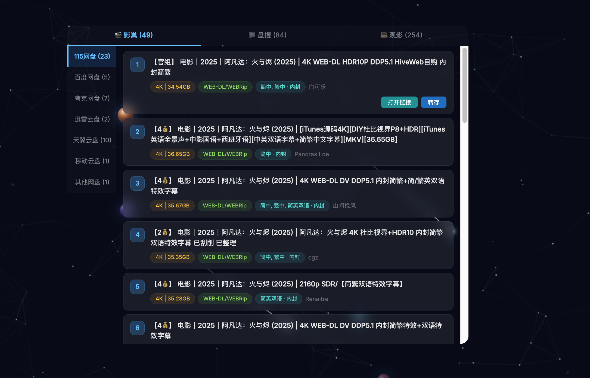
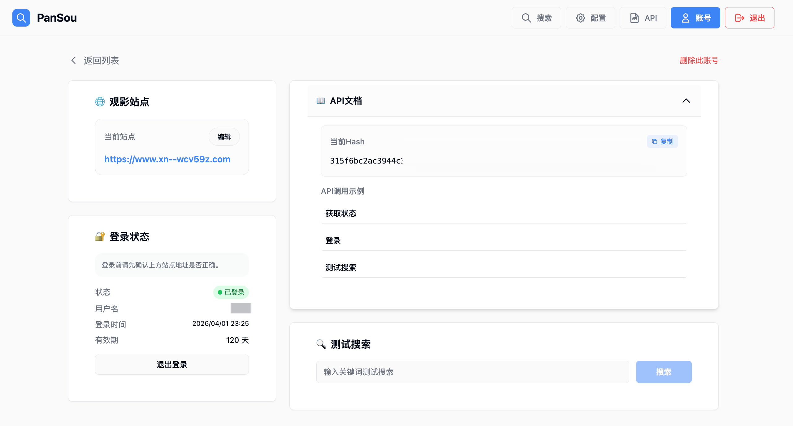

# CMS 增强插件说明

当前代码实际覆盖 4 块能力：
- Web 搜索增强
- Telegram 机器人搜索 / 订阅管理增强
- 企业微信搜索 / 豆瓣热门 / 订阅管理增强
- CMS 原生订阅搜源增强

## 当前支持的搜索源

- `影巢`
- `盘搜`
- `观影`

三者是独立可选的。
只要至少配置一个搜索源，增强逻辑就会注入；不会要求三个源同时可用。

## 功能概览

### Web

- 搜索弹窗支持 `影巢 / 盘搜 / 观影` 三个来源页签。
- 打开搜索弹窗后，会并行预搜索所有已启用的来源，不需要手动切标签才开始请求。
- 默认优先显示第一个有结果的来源。
- `影巢` 收费资源不会在普通搜索时自动解锁，必须手动确认。
- `115` 资源支持 `打开链接 / 转存`。
- `磁链` 资源只显示 `转存`。
- 其他网盘 / 直链资源显示 `打开链接`。
- 单击走增强搜索，双击继续走 CMS 原生订阅逻辑。

WEB 弹窗页面资源搜索示意图：



### Telegram

- 直接发送关键词即可自动搜索 `影巢 / 盘搜 / 观影`。
- 如果命中多个影视候选，会先返回候选列表，回复序号后再展示聚合资源。
- 支持 `影巢` 收费资源按钮确认解锁。
- 支持文本命令：
  - `订阅 xxx`
  - `退订 xxx`
  - `当前订阅`
  - `删除已完成`
- 同名订阅目标不唯一时，会返回候选列表，回复数字继续。
- `当前订阅` 支持直接回复序号删除，也支持 `1,2,3` 批量删除。
- 菜单增加当前订阅 `/current_subscriptions`

### 企业微信

- 直接发送关键词即可自动搜索 `影巢 / 盘搜 / 观影`。
- 如果命中多个影视候选，会先返回候选列表，回复序号后再展示聚合资源。
- 支持 `影巢` 收费资源数字解锁。
- 支持：
  - `订阅`
  - `退订`
  - `当前订阅`
  - `删除已完成`
- 支持 `豆瓣热门电影 / 豆瓣热门电视剧`。
- 会向企业微信 `插件` 菜单注入：
  - `当前订阅`
  - `豆瓣热门电影`
  - `豆瓣热门电视剧`

说明：
- 企业微信数字回复存在 4 种上下文：
  - 影巢付费解锁
  - 订阅候选确认
  - 搜索候选确认
  - 当前订阅删除

### 订阅搜源增强

- 把 `影巢 / 观影 / 盘搜` 作为虚拟订阅源接入 CMS 原生 `sync_sub`。
- 搜索时支持 `标题 + 年份` 失败后回退到纯标题。
- 只把适合 CMS 转存的分享链接喂给原生转存流程。
- `影巢` 收费资源不会在订阅搜源阶段自动解锁，不会自动扣积分。
- CMS 原版订阅源不会被禁用，而是在原版基础上追加增强源。

## 触发规则

### 搜索

TG / 企业微信里，直接发送关键词即可开始搜索。
脚本会自动聚合 `影巢 / 观影 / 盘搜` 资源。

### 订阅

支持以下格式：

```text
订阅 哪吒2
订阅 狂飙
订阅 葬送的芙莉莲
```

特点：
- 默认直接按关键词返回订阅候选，不需要在前面额外写 `电影` / `电视剧`
- 如果你想强制缩小范围，仍然支持前缀指定 `电影 / 电视剧 / tv / movie / 动漫`
- 支持动画倾向词：`动漫 / 动画 / 番剧 / 国漫 / 日漫 / anime` 等
- 支持末尾年份拆分，用于更准确地做 TMDB 候选匹配

### 退订

支持：

```text
退订 哪吒2
取消订阅 哪吒2
退订 电视剧 狂飙
退订 2
退订 1,2,3
```

### 当前订阅

支持以下等价写法：

```text
当前订阅
订阅列表
我的订阅
/current_subscriptions
```
### 删除已完成

支持以下等价写法：

```text
删除已完成
删除已完成订阅
清理已完成
```

### 豆瓣热门

支持：

```text
豆瓣热门电影
豆瓣热门电视剧
热门电影
热门电视剧
```

### 盘搜

使用下面 `Pansou` 容器配置：
账户密码根据自己需求更改
```yaml
services:
  pansou:
    image: ghcr.io/gctts/pansou:latest
    container_name: pansou
    labels:
      - "autoheal=true"
    ports:
      - "23805:80"
    environment:
      # 基础配置
      - DOMAIN=localhost
      - PANSOU_PORT=8888
      - PANSOU_HOST=127.0.0.1

      # 数据目录配置
      - CACHE_PATH=/app/data/cache
      - LOG_PATH=/app/data/logs

      # 插件配置
      - >-
        ENABLED_PLUGINS=labi,zhizhen,shandian,duoduo,muou,wanou,hunhepan,jikepan,panwiki,
        pansearch,panta,qupansou,hdr4k,pan666,susu,thepiratebay,xuexizhinan,panyq,ouge,
        huban,cyg,erxiao,miaoso,fox4k,pianku,clmao,wuji,cldi,xiaozhang,libvio,leijing,
        xb6v,xys,ddys,hdmoli,yuhuage,u3c3,javdb,clxiong,jutoushe,sdso,xiaoji,xdyh,
        haisou,bixin,djgou,nyaa,xinjuc,aikanzy,qupanshe,xdpan,discourse,yunsou,qqpd,
        ahhhhfs,nsgame,gying,quark4k,quarksoo,sousou,ash

      # Telegram频道配置
      - >-
        CHANNELS=Aliyun_4K_Movies,baicaoZY,Baidu_netdisk,baidu_yppan,BaiduCloudDisk,
        bdbdndn11,bdwpzhpd,BooksRealm,bsbdbfjfjff,btzhi,CBduanju,Channel_Shares_115,
        cilidianying,ciliziyuanku,cloudtianyi,D_wusun,douerpan,duan_ju,dzsgx,
        FLMdongtianfudi,gotopan,guoman4K,hdhhd21,jdjdn1111,jxwpzy,KaiPanshare,kduanju,
        kkdj001,kuakedongman,leoziyuan,Lsp115,MCPH01,MCPH02,MCPH03,MCPH086,
        movielover8888_film3,Netdisk_Movies,newproductsourcing,oneonefivewpfx,
        Oscar_4Kmovies,PanjClub,peccxinpd,PikPak_Share_Channel,pikpakpan,pxyunpanxunlei,
        Q_dongman,Q_jilupian,Q66Share,qixingzhenren,QQZYDAPP,Quark_Movies,QuarkFree,
        QukanMovie,rjyxfx,shareAliyun,SharePanFilms,solidsexydoll,taoxgzy,TG654TG,
        tianyifc,tianyirigeng,txtyzy,tyypzhpd,tyysypzypd,ucquark,ucwpzy,vip115hot,
        wp123zy,xiangnikanj,XiangxiuNBB,xx123pan,xxzlzn,ydypzyfx,yeqingjie_GJG666,
        yggpan,yingshifenxiang123,yoyokuakeduanju,yp123pan,ysxb48,yunpan139,yunpan189,
        yunpanNB,yunpanquark,yunpanuc,yunpanx,yunpanxunlei,yydf_hzl,zaihuayun,zdqxm,
        zyfb123,gimy115,gimy100,gimy115iso,yingshiziyuanpindao

      # 代理配置
      - PROXY=http://10.10.10.20:7890

      # 健康检查配置
      - HEALTH_CHECK_INTERVAL=30
      - HEALTH_CHECK_TIMEOUT=10
      - HEALTH_CHECK_RETRIES=3

      # 认证配置
      - AUTH_ENABLED=true
      - AUTH_USERS=xxxxxxxx:xxxxxxx
      - AUTH_TOKEN_EXPIRY=24000
      - AUTH_JWT_SECRET=CMQ-mbn2cmf.mjn7qvf
    volumes:
      - ./data:/app/data
    restart: unless-stopped
    network_mode: bridge

  autoheal:
    image: willfarrell/autoheal:latest
    container_name: pansou-autoheal
    restart: always
    environment:
      - AUTOHEAL_CONTAINER_LABEL=autoheal
      - AUTOHEAL_INTERVAL=30
      - AUTOHEAL_START_PERIOD=60
      - AUTOHEAL_DEFAULT_STOP_TIMEOUT=10
    volumes:
      - /var/run/docker.sock:/var/run/docker.sock
    network_mode: bridge
```

如果按上面方式部署：
- `PANSO_URL` 填盘搜容器对 CMS 可访问的地址，例如 `http://宿主机IP:23805`
- `PANSO_USERNAME` / `PANSO_PASSWORD` 需要和 `AUTH_USERS` 里的账号密码一致
- `ENABLED_PLUGINS` 里要保留你需要的 `gying` / 网盘 / 磁链插件

### 影巢

说明：
- 最小启用条件是 `HDHIVE_API_KEY`
- `HDHIVE_PROXY` 不填时，会尝试走 CMS 全局代理或直连

### 观影

说明：
- `观影` 客户端复用 `PANSO_URL` 作为服务端基地址
- 最小启用条件是：
  - `PANSO_URL` 存在
  - 且 `GYING_HASH` 或 `GYING_USERNAME` 至少有一个
- `GYING_HASH` 获取方式：
  - 打开盘搜网页
  - 进入右上角 `账号`
  - 在账号页先登录观影账户
  - 在右侧 `API文档` 区域复制 `当前Hash`



### CMS 额外环境变量

当前使用的 CMS compose 至少需要补下面 5 个环境变量：

```yaml
      - PANSO_URL=http://10.10.10.40:23805
      - PANSO_USERNAME=xxxxxxxx
      - PANSO_PASSWORD=xxxxxxx
      - HDHIVE_API_KEY=xxxxxxxxxxxxxxx
      - GYING_HASH=xxxxxxxxxxxxxxxx
```

当前编译产物不再放在仓库根目录，改为放到 GitHub `Releases`。

下载地址：
- [Latest Release](https://github.com/gctts/cms-enhanced-updates/releases/latest)

Release 里的文件名通常是：

- `usercustomize.cpython-312-x86_64-linux-gnu.so`
- `usercustomize.cpython-312-aarch64-linux-gnu.so`

你可以：
- 直接按原文件名挂载
- 或者自己重命名为 `usercustomize.so` 再挂载

`.so` 挂载示例：

```yaml
      - ./usercustomize.so:/cms/cms-api/usercustomize.so
```

说明：
- 更换 `.so` 后一定重启 CMS 容器
